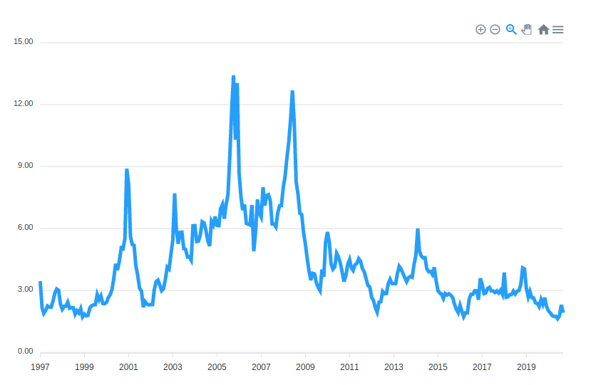

<div align="center"> 

# Henry Hub Natural Gas Spot Price

</div>
</br>



</br>
</br>

<p>To check this project online on Github Pages, <a href="https://cotts.github.io/natural-gas-price/" > clicking here</a>.</p>

</br>

## Chart Usage
 > This Chart has a Menu with extra features to increase the experience to see and manage data

</br>
 

* Zoom In
* Zoom Out
* Zoom Range
* Move Graph
* Home
* Side Menu With:
* * Download PNG
* * Download SVG
* * Download CSV
</br>
</br>

## Build with
- Node.js
- Vue.js

</br>

## Instructions

</br>

### Install Dependencies
```
$ npm install
```

### Run script
```
$ npm start
```
* The output file will be located on `/data/monthlyPrices.csv`

</br>

## Front-end Instructions

</br>

### Install Dependencies
```
$ npm install
```

### Run on Development Mode
```
$ npm run dev
```

### Build Project
```
npm run build
```

</br>

## Contributing

Please read [CONTRIBUTING.md](CONTRIBUTING.md) for details on our code of conduct, and the process for submitting pull requests to us.

</br>

## Author

* **Thadeu Cotts**

</br>

## License

This project is licensed under the MIT License - see the [LICENSE.md](LICENSE.md) file for details